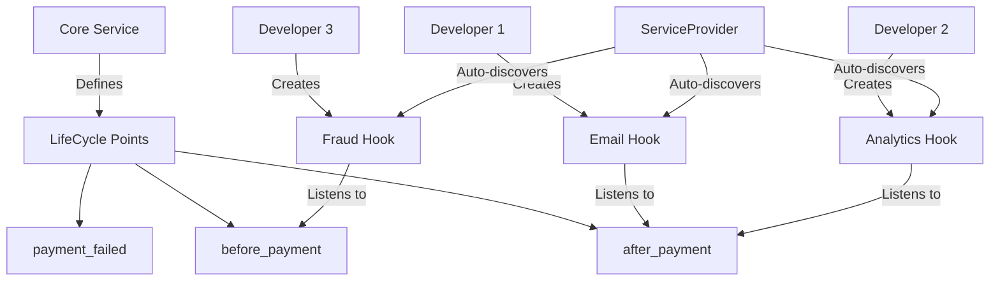

# 🚀 Laravel LifeCycle Hooks

### Modular Architecture with Diffused Programming ✨

[](https://packagist.org/packages/php-diffused/lifecycle)
[](https://packagist.org/packages/php-diffused/lifecycle)
[](https://packagist.org/packages/php-diffused/lifecycle)
[](https://github.com/php-diffused/lifecycle/blob/main/LICENSE)
[](https://github.com/php-diffused/lifecycle/actions)

> **Diffused Programming**: Allow different developers (including juniors) to inject business logic into specific lifecycle points without modifying core classes.

---

## 🧭 Philosophy & Best Practices

> **Laravel LifeCycle Hooks** is designed to keep your core business logic clean, extensible, and maintainable — especially for teams with mixed experience levels.  
> To keep the architecture healthy and the project easy to scale, we follow some key principles:

- **Hooks serve to complement, not to alter, critical flows without team review.**
- **Any mutation of reference data must be documented directly within the hook.**
- **Hooks should never depend on the output of other hooks, unless there's a well-documented technical reason.**
- **The core logic remains untouched; all custom behaviors are handled by hooks.**

Following these principles ensures transparency, testability, and safe collaboration across all skill levels.

---

## 🎯 Why Laravel LifeCycle Hooks?

Imagine you have a `PaymentService` and multiple developers need to add different behaviors:
- Junior dev needs to send email notifications
- Another dev wants to update analytics
- A third dev handles fraud detection
- Yet another manages inventory updates

**Traditional approach**: Everyone modifies the same `PaymentService` class 😱  
**LifeCycle Hooks approach**: Core logic stays clean, additional behaviors are injected ✨

## 🔥 Quick Example

### ✨ Modern PHP 8+ Approach with Attributes

```php
use PhpDiffused\Lifecycle\Attributes\LifeCyclePoint;
use PhpDiffused\Lifecycle\Traits\HasLifecycle;

// 🎯 Core service with modern PHP 8+ attributes
#[LifeCyclePoint('before_payment', ['user_id', 'amount'])]
#[LifeCyclePoint('after_payment', ['user_id', 'amount', 'payment_id'])]
#[LifeCyclePoint('payment_failed', ['user_id', 'amount', 'error'])]
class PaymentService
{
    use HasLifecycle;
    
    public function process(int $userId, float $amount): string
    {
        runHook($this, 'before_payment', $userId, $amount);
        
        // Use potentially modified amount
        $paymentId = $this->doPayment($userId, $amount);
        
        runHook($this, 'after_payment', $userId, $amount, $paymentId);
        
        return $paymentId;
    }
}
```

```php
use PhpDiffused\Lifecycle\Attributes\Hook;
use PhpDiffused\Lifecycle\Attributes\Severity;
use PhpDiffused\Lifecycle\Traits\Hookable;

// 🎨 Modern hooks with attributes and traits
#[Hook(scope: 'PaymentService', point: 'after_payment', severity: Severity::Optional)]
class EmailNotificationHook
{
    use Hookable;
    
    public function handle(array &$args): void
    {
        Mail::to($args['user_id'])->send(new PaymentConfirmation($args));
    }
}

#[Hook(scope: 'PaymentService', point: 'before_payment', severity: Severity::Critical)]
class FraudDetectionHook
{
    use Hookable;
    
    public function handle(array &$args): void
    {
        if ($this->isFraudulent($args)) {
            throw new FraudException('Suspicious activity detected');
        }
    }
}
```


## 📦 Installation

```bash
composer require php-diffused/lifecycle
```

### Register Service Provider

Add the service provider to your `config/app.php`:

```php
'providers' => [
    // ...
    PhpDiffused\Lifecycle\LifeCycleServiceProvider::class,
],
```

### Publish Kernel (Recommended)

```bash
php artisan vendor:publish --tag=lifecycle-kernel
```

This creates `app/Hooks/Kernel.php` where you register all your hooks:

```php
<?php

namespace App\Hooks;

class Kernel
{
    public array $hooks = [
        \App\Services\PaymentService::class => [
            'before_payment' => [
                \App\Hooks\FraudDetectionHook::class,
                \App\Hooks\ValidateAmountHook::class,
            ],
            'after_payment' => [
                \App\Hooks\PaymentEmailHook::class,
                \App\Hooks\PaymentAnalyticsHook::class,
            ],
        ],
    ];
}
```

### Publish Configuration (Optional)

```bash
php artisan vendor:publish --tag=lifecycle-config
```

#### **Leverage External Hook Execution**
```php
// Now you can execute hooks from anywhere!

// In a controller
public function processPayment(Request $request) {
    $amount = $request->input('amount');
    
    // Execute hooks without instantiating the service
    runHook(PaymentService::class, 'payment.begin', $amount);
    
    // Then process normally
    $service = app(PaymentService::class);
    return $service->process($amount);
}

// In tests
public function test_payment_hooks() {
    $amount = 100.00;
    
    // Add test-specific hooks
    $testHook = new TestPaymentHook();
    addHook(PaymentService::class, $testHook);
    
    // Execute and verify
    runHook(PaymentService::class, 'payment.begin', $amount);
    
    $this->assertTrue($testHook->wasExecuted());
}
```

## ⚙️ Configuration

### Available Configuration Options

```php
// config/lifecycle.php

return [    
    // Error handling configuration
    'error_handling' => [
        'log_failures' => true,
        'throw_on_critical' => true,
    ],
    
    'debug' => true, // Enable debug mode for detailed logging
];
```

### Artisan Commands

Generate lifecycle classes and hooks:

```bash
# Generate a new lifecycle service class
php artisan lifecycle:main App/Services/PaymentService

# Generate a new hook (saved in app/Hooks/)
php artisan lifecycle:hook ValidatePaymentHook --scope=payment --point=before_payment --severity=Critical
php artisan lifecycle:hook ProcessDiscountHook --scope=payment --point=after_payment --severity=Optional
```

### Debug Mode

Enable detailed debug logging:

```php
// In .env
LIFECYCLE_DEBUG=true

// Or in config/lifecycle.php
'debug' => true,
```

Debug output shows the complete execution flow:

```
=== [App\Services\PaymentService] Lifecycle 'process_payment' started ===
→ [Hook] App\Hooks\DiscountHook executing...
  Variables before: {"amount": "1000.0", "user_id": "123"}
✓ [Hook] App\Hooks\DiscountHook completed (modified variables)
  Variables after: {"amount": "900.0", "user_id": "123"}
=== [App\Services\PaymentService] Lifecycle 'process_payment' completed ===
```

## 🏗️ Architecture Overview



### 🔄 **Dynamic Hook Management**
Add or remove hooks programmatically:

```php
// Add hooks dynamically
$customHook = new MyCustomHook();
addHook(PaymentService::class, $customHook);

// Remove all hooks for a specific lifecycle
removeHooksFor(PaymentService::class, 'payment.failed');
```

## 🎯 Key Features

### 🔧 **Modular Development**
- **Core developers** focus on business logic
- **Feature developers** add behaviors without touching core
- **Junior developers** can contribute safely

### 🛡️ **Hook Severity**

```php
use PhpDiffused\Lifecycle\Attributes\Hook;
use PhpDiffused\Lifecycle\Attributes\Severity;
use PhpDiffused\Lifecycle\Traits\Hookable;

// ⚠️ Critical hooks MUST succeed
#[Hook(scope: 'PaymentService', point: 'before_payment', severity: Severity::Critical)]
class FraudDetectionHook
{
    use Hookable;
    
    public function handle(array &$args): void
    {
        if ($this->detectFraud($args)) {
            throw new \Exception('Fraud detected!');
        }
    }
}

// 💡 Optional hooks fail gracefully  
#[Hook(scope: 'PaymentService', point: 'after_payment', severity: Severity::Optional)]
class EmailNotificationHook
{
    use Hookable;
    
    public function handle(array &$args): void
    {
        // If this fails, payment still succeeds
        Mail::send(/* ... */);
    }
}
```

### 🎯 **Kernel-Based Registration**

All hooks are explicitly registered in the Kernel for better control and performance:

```php
// app/Hooks/Kernel.php
public array $hooks = [
    \App\Services\PaymentService::class => [
        'before_payment' => [
            \App\Hooks\FraudDetectionHook::class,      // Critical - runs first
            \App\Hooks\ValidateAmountHook::class,      // Critical - validation
        ],
        'after_payment' => [
            \App\Hooks\PaymentEmailHook::class,        // Optional - notifications
            \App\Hooks\PaymentAnalyticsHook::class,    // Optional - tracking
        ],
    ],
    
    \App\Services\OrderService::class => [
        'after_create' => [
            \App\Hooks\InventoryUpdateHook::class,     // Critical - inventory
            \App\Hooks\OrderNotificationHook::class,   // Optional - email
        ],
    ],
];
```

**Flexible Hook Organization:**
```
app/Hooks/
├── FraudDetectionHook.php      ← Modern attributes
├── PaymentEmailHook.php        ← Modern attributes
├── PaymentAnalyticsHook.php    ← Modern attributes
└── Legacy/
    └── OldStyleHook.php        ← Legacy interfaces (still supported)
```

### ✅ **Argument Validation**

Hooks receive exactly what they expect with modern attributes:

```php
use PhpDiffused\Lifecycle\Attributes\LifeCyclePoint;
use PhpDiffused\Lifecycle\Traits\HasLifecycle;

#[LifeCyclePoint('before_payment', ['user_id', 'amount'])]        // ✅ Required args
#[LifeCyclePoint('after_payment', ['user_id', 'amount', 'payment_id'])]
class PaymentService
{
    use HasLifecycle;
}
```


### 🔢 **Hook Ordering**

Control execution order in the Kernel:

```php
// app/Hooks/Kernel.php
public array $hooks = [
    \App\Services\PaymentService::class => [
        'before_payment' => [
            \App\Hooks\ValidateAmountHook::class,    // 1st: Validation
            \App\Hooks\FraudDetectionHook::class,    // 2nd: Security
            \App\Hooks\ApplyDiscountHook::class,     // 3rd: Business logic
        ],
        'after_payment' => [
            \App\Hooks\PaymentEmailHook::class,      // 1st: Notifications
            \App\Hooks\PaymentAnalyticsHook::class,  // 2nd: Analytics
        ]
    ]
];
```

Hooks execute in the **exact order** defined in the Kernel, giving you complete control over the execution flow.

---

## ✨ **Modern PHP 8+ Features**

### 🎯 **Key Benefits**

- ✅ **Cleaner Code**: Less boilerplate, more declarative
- ✅ **Type Safety**: Enums prevent typos in severity levels
- ✅ **IDE Support**: Better autocomplete and navigation
- ✅ **Performance**: Direct Kernel registration, no filesystem scanning
- ✅ **Flexibility**: Hooks can be anywhere, not tied to directory structure
- ✅ **Maintainability**: Clear separation of concerns with traits

## 🚀 Getting Started

### 1. Create Your Service

```php
<?php

namespace App\Services;

use PhpDiffused\Lifecycle\Attributes\LifeCyclePoint;
use PhpDiffused\Lifecycle\Traits\HasLifecycle;

#[LifeCyclePoint('before_create', ['user_id', 'products'])]
#[LifeCyclePoint('after_create', ['user_id', 'order_id', 'total'])]
#[LifeCyclePoint('before_ship', ['order_id'])]
#[LifeCyclePoint('after_ship', ['order_id', 'tracking_number'])]
class OrderService
{
    use HasLifecycle;
    
    public function createOrder(int $userId, array $products): string
    {
        runHook($this, 'before_create', $userId, $products);
        
        // Use potentially modified products
        $orderId = $this->processOrder($userId, $products);
        $total = $this->calculateTotal($products);
        
        runHook($this, 'after_create', $userId, $orderId, $total);
        
        return $orderId;
    }
}
```

### 2. Create Hooks

```php
<?php

namespace App\Hooks;

use PhpDiffused\Lifecycle\Attributes\Hook;
use PhpDiffused\Lifecycle\Attributes\Severity;
use PhpDiffused\Lifecycle\Traits\Hookable;

#[Hook(scope: 'OrderService', point: 'after_create', severity: Severity::Critical)]
class InventoryUpdateHook
{
    use Hookable;
    
    public function handle(array &$args): void
    {
        $this->updateInventory($args['products']);
    }
}

#[Hook(scope: 'OrderService', point: 'after_create', severity: Severity::Optional)]
class WelcomeEmailHook
{
    use Hookable;
    
    public function handle(array &$args): void
    {
        Mail::to($args['user_id'])->send(new WelcomeEmail($args));
    }
}
```

### 3. Register Hooks in Kernel

```php
// app/Hooks/Kernel.php
public array $hooks = [
    \App\Services\OrderService::class => [
        'after_create' => [
            \App\Hooks\InventoryUpdateHook::class,  // Critical - runs first
            \App\Hooks\WelcomeEmailHook::class,     // Optional - runs after
        ],
    ],
];
```

### 3. Organize Hooks by Lifecycle (NEW!)

Create organized, maintainable hook structures:

```php
// Your service defines lifecycles
class PaymentService implements LifeCycle {
    public static function lifeCycle(): array {
        return [
            'paymentBegin' => ['amount', 'currency', 'userId'],
            'payment_complete' => ['transactionId', 'amount'],
            'payment.failed' => ['error', 'userId'],
        ];
    }
}
```

**Create Your Hooks**
```
app/Hooks/PaymentService/
├── ValidateAmountHook.php
├── ApplyDiscountHook.php
├── SendEmailHook.php
└── LogErrorHook.php
```

### 4. Execute Hooks Externally

Execute hooks from anywhere - controllers, commands, tests:

```php
<?php

namespace App\Http\Controllers;

class PaymentController extends Controller
{
    public function process(Request $request)
    {
        $amount = $request->input('amount');
        $currency = $request->input('currency');
        $userId = auth()->id();
        
        // Execute hooks without instantiating the service!
        runHook(PaymentService::class, 'paymentBegin', $amount, $currency, $userId);
        
        // Process payment...
        $service = app(PaymentService::class);
        return $service->processPayment($amount, $currency, $userId);
    }
}
```

### 5. Define Hook Order (Optional)
Control the execution order of your hooks:

```bash
php artisan vendor:publish --tag=lifecycle-kernel
```

Edit `app/Hooks/Kernel.php`:
```php
class Kernel
{
    public array $hooks = [
        \App\Services\PaymentService::class => [
            'before_payment' => [
                \App\Hooks\PaymentService\ValidateAmountHook::class,
                \App\Hooks\PaymentService\FraudDetectionHook::class,
                \App\Hooks\PaymentService\ApplyDiscountHook::class,
            ],
            'after_payment' => [
                \App\Hooks\PaymentService\SendEmailHook::class,
                \App\Hooks\PaymentService\UpdateAnalyticsHook::class,
            ]
        ],
    ];
}
```

### 4. Use Your Service
```php
// Laravel automatically injects hooks in the defined order
$orderService = app(OrderService::class);

// All hooks run automatically
$orderId = $orderService->createOrder(123, $products);
```

## 🎨 Advanced Usage

### Dynamic Hook Management
```php
// Add hooks at runtime
$service->addHook(new CustomHook());

// Remove hooks for specific lifecycle
$service->removeHooksFor('before_payment');

// Get all hooks
$hooks = $service->getHooks();
```

### Using runHook with Spread Operator

```php
class OrderService implements LifeCycle
{
    use HasLifeCycleHooks;
    
    public static function lifeCycle(): array
    {
        return [
            'calculate_total' => ['items', 'subtotal', 'tax', 'discount']
        ];
    }
    
    public function calculateTotal(array $items): array
    {
        $subtotal = $this->calculateSubtotal($items);
        $tax = 0;
        $discount = 0;
        
        // Pass variables directly - they will be modified by reference
        $this->runHook('calculate_total', $items, $subtotal, $tax, $discount);
        
        return [
            'subtotal' => $subtotal,
            'tax' => $tax,
            'discount' => $discount,
            'total' => $subtotal + $tax - $discount
        ];
    }
}
```

### 🔄 Mutable Hooks (Pass by Reference)

Hooks can modify values that are passed through the lifecycle using spread operator:

```php
use PhpDiffused\Lifecycle\Attributes\LifeCyclePoint;
use PhpDiffused\Lifecycle\Traits\HasLifecycle;

#[LifeCyclePoint('before_payment', ['user_id', 'amount'])]
class PaymentService
{
    use HasLifecycle;
    
    public function processPayment(int $userId, float $amount): array
    {
        $originalAmount = $amount;
        
        // Pass variables directly - they will be modified by reference
        runHook($this, 'before_payment', $userId, $amount);
        
        // Use modified values directly
        return [
            'original_amount' => $originalAmount,
            'final_amount' => $amount,  // Modified directly by hooks
            'user_id' => $userId
        ];
    }
}
```

```php
use PhpDiffused\Lifecycle\Attributes\Hook;
use PhpDiffused\Lifecycle\Attributes\Severity;
use PhpDiffused\Lifecycle\Traits\Hookable;

// Modern hook implementation with attributes
#[Hook(scope: 'PaymentService', point: 'before_payment', severity: Severity::Optional)]
class ApplyDiscountHook
{
    use Hookable;
    
    public function handle(array &$args): void
    {
        // The framework maps your variables to the array automatically
        $args['amount'] *= 0.9;  // 10% discount
    }
}
```

Multiple hooks can chain modifications:
```php
$amount = 100.00;
$userId = 123;

// Hooks registered in Kernel:
// 1. ApplyDiscountHook  // 100 -> 90
// 2. ApplyTaxHook       // 90 -> 97.20

runHook(PaymentService::class, 'before_payment', $userId, $amount);

echo $amount; // 97.20 - modified directly by hooks!
```

### Hook Conditions
```php
class ConditionalHook implements LifeCycleHook
{
    public function handle(array &$args): void
    {
        if ($args['amount'] > 1000) {
            // Only run for high-value transactions
            $this->notifyManager($args);
        }
    }
}
```

## 🔧 Configuration

```php
// config/lifecycle.php
return [
    'discovery' => [
        'enabled' => true,
        'cache' => env('LIFECYCLE_CACHE', true),
    ],
    
    'execution' => [
        'timeout' => 30,
        'async' => false,
        'queue' => 'default',
    ],
];
```

## 🧪 Testing

```bash
# Run tests
composer test

# Run with coverage
composer test:coverage
```

## 🤝 Contributing

We love contributions! Here's how different skill levels can help:

### 🎯 **Junior Developers**
- Create new hooks for existing services
- Add documentation examples
- Write tests for edge cases

### 🚀 **Senior Developers**  
- Optimize hook discovery performance
- Add async hook execution
- Create new lifecycle patterns

### 🏗️ **Architects**
- Design new lifecycle interfaces
- Improve auto-discovery algorithms
- Add distributed hooks support

## 💖 Support the Project

- ⭐ Star the repository
- 🐛 Report bugs
- 💡 Suggest features
- 📝 Improve documentation

## 📄 License

MIT License - see [LICENSE](LICENSE) for details.

---

<div align="center">

**Made with ❤️ by the PHP Diffused community**

[🌟 Star us on GitHub](https://github.com/php-diffused/lifecycle) • [📖 Documentation](https://docs.php-diffused.com) • [💬 Discord](https://discord.gg/php-diffused)

</div>