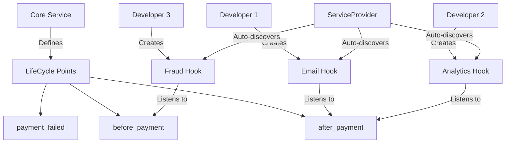

# 🚀 Laravel LifeCycle Hooks

### Modular Architecture with Diffused Programming ✨

[](https://packagist.org/packages/php-diffused/lifecycle)
[](https://packagist.org/packages/php-diffused/lifecycle)
[](https://packagist.org/packages/php-diffused/lifecycle)
[](https://github.com/php-diffused/lifecycle/blob/main/LICENSE)
[](https://github.com/php-diffused/lifecycle/actions)

> **Diffused Programming**: Allow different developers (including juniors) to inject business logic into specific lifecycle points without modifying core classes.

---

## 🧭 Philosophy & Best Practices

> **Laravel LifeCycle Hooks** is designed to keep your core business logic clean, extensible, and maintainable — especially for teams with mixed experience levels.  
> To keep the architecture healthy and the project easy to scale, we follow some key principles:

- **Hooks serve to complement, not to alter, critical flows without team review.**
- **Any mutation of reference data must be documented directly within the hook.**
- **Hooks should never depend on the output of other hooks, unless there's a well-documented technical reason.**
- **The core logic remains untouched; all custom behaviors are handled by hooks.**

Following these principles ensures transparency, testability, and safe collaboration across all skill levels.

---

## 🎯 Why Laravel LifeCycle Hooks?

Imagine you have a `PaymentService` and multiple developers need to add different behaviors:
- Junior dev needs to send email notifications
- Another dev wants to update analytics
- A third dev handles fraud detection
- Yet another manages inventory updates

**Traditional approach**: Everyone modifies the same `PaymentService` class 😱  
**LifeCycle Hooks approach**: Core logic stays clean, additional behaviors are injected ✨

## 🔥 Quick Example

```php
// 🎯 Core service stays clean and focused
class PaymentService implements LifeCycle
{
    use HasLifeCycleHooks;
    
    public static function lifeCycle(): array
    {
        return [
            'before_payment' => ['user_id', 'amount'],
            'after_payment' => ['user_id', 'amount', 'payment_id'],
            'payment_failed' => ['user_id', 'amount', 'error'],
        ];
    }
    
    public function process(int $userId, float $amount): string
    {
        $args = ['user_id' => $userId, 'amount' => $amount];
        $this->runHook('before_payment', $args);
        
        // Use potentially modified amount
        $paymentId = $this->doPayment($userId, $args['amount']);
        
        $afterArgs = ['user_id' => $userId, 'amount' => $args['amount'], 'payment_id' => $paymentId];
        $this->runHook('after_payment', $afterArgs);
        
        return $paymentId;
    }
}

// 🎨 Different developers add their behaviors separately
class EmailNotificationHook implements LifeCycleHook
{
    public function getLifeCycle(): string { return 'after_payment'; }
    public function getSeverity(): string { return 'optional'; }
    
    public function handle(array &$args): void
    {
        Mail::to($args['user_id'])->send(new PaymentConfirmation($args));
    }
}

class FraudDetectionHook implements LifeCycleHook  
{
    public function getLifeCycle(): string { return 'before_payment'; }
    public function getSeverity(): string { return 'critical'; }
    
    public function handle(array &$args): void
    {
        if ($this->isFraudulent($args)) {
            throw new FraudException('Suspicious activity detected');
        }
    }
}
```

## 📦 Installation

```bash
composer require php-diffused/lifecycle
```

### Publish Configuration
```bash
php artisan vendor:publish --tag=lifecycle-config
```

## 🏗️ Architecture Overview



## 🎯 Key Features

### 🔧 **Modular Development**
- **Core developers** focus on business logic
- **Feature developers** add behaviors without touching core
- **Junior developers** can contribute safely

### 🛡️ **Hook Severity**
```php
// ⚠️ Critical hooks MUST succeed
public function getSeverity(): string { return 'critical'; }

// 💡 Optional hooks fail gracefully  
public function getSeverity(): string { return 'optional'; }
```

### 🔍 **Auto-Discovery**
Drop hooks in `app/Hooks/ServiceName/` and they're automatically loaded:
```
app/Hooks/
├── PaymentService/
│   ├── EmailNotificationHook.php
│   ├── FraudDetectionHook.php
│   └── AnalyticsHook.php
└── OrderService/
    ├── InventoryUpdateHook.php
    └── ShippingNotificationHook.php
```

### ✅ **Argument Validation**
Hooks receive exactly what they expect:
```php
public static function lifeCycle(): array
{
    return [
        'before_payment' => ['user_id', 'amount'],        // ✅ Required args
        'after_payment' => ['user_id', 'amount', 'payment_id'], 
    ];
}
```

### 🔢 **Hook Ordering**
Control execution order when it matters:
```php
public array $hookOrder = [
    PaymentService::class => [
        'before_payment' => [
            ValidateHook::class,    // 1st: Validation
            FraudHook::class,       // 2nd: Security
            DiscountHook::class,    // 3rd: Business logic
        ]
    ]
];
```

## 🚀 Getting Started

### 1. Create Your Service
```php
<?php

namespace App\Services;

use PhpDiffused\Lifecycle\Contracts\LifeCycle;
use PhpDiffused\Lifecycle\Support\HasLifeCycleHooks;

class OrderService implements LifeCycle
{
    use HasLifeCycleHooks;
    
    public static function lifeCycle(): array
    {
        return [
            'before_create' => ['user_id', 'products'],
            'after_create' => ['user_id', 'order_id', 'total'],
            'before_ship' => ['order_id'],
            'after_ship' => ['order_id', 'tracking_number'],
        ];
    }
    
    public function createOrder(int $userId, array $products): string
    {
        $beforeArgs = ['user_id' => $userId, 'products' => $products];
        $this->runHook('before_create', $beforeArgs);
        
        // Use potentially modified products
        $orderId = $this->processOrder($userId, $beforeArgs['products']);
        $total = $this->calculateTotal($beforeArgs['products']);
        
        $afterArgs = ['user_id' => $userId, 'order_id' => $orderId, 'total' => $total];
        $this->runHook('after_create', $afterArgs);
        
        return $orderId;
    }
}
```

### 2. Create Hooks
```php
<?php

namespace App\Hooks\OrderService;

use PhpDiffused\Lifecycle\Contracts\LifeCycleHook;

class InventoryUpdateHook implements LifeCycleHook
{
    public function getLifeCycle(): string
    {
        return 'after_create';
    }
    
    public function getSeverity(): string
    {
        return 'critical'; // Must succeed
    }
    
    public function handle(array &$args): void
    {
        $this->updateInventory($args['products']);
    }
}

class WelcomeEmailHook implements LifeCycleHook
{
    public function getLifeCycle(): string
    {
        return 'after_create';
    }
    
    public function getSeverity(): string
    {
        return 'optional'; // Can fail gracefully
    }
    
    public function handle(array &$args): void
    {
        Mail::to($args['user_id'])->send(new WelcomeEmail($args));
    }
}
```

### 3. Define Hook Order (Optional)
Control the execution order of your hooks:

```bash
php artisan vendor:publish --tag=lifecycle-kernel
```

Edit `app/Hooks/HooksKernel.php`:
```php
class HooksKernel
{
    public array $hookOrder = [
        \App\Services\PaymentService::class => [
            'before_payment' => [
                \App\Hooks\PaymentService\ValidateAmountHook::class,
                \App\Hooks\PaymentService\FraudDetectionHook::class,
                \App\Hooks\PaymentService\ApplyDiscountHook::class,
            ],
            'after_payment' => [
                \App\Hooks\PaymentService\SendEmailHook::class,
                \App\Hooks\PaymentService\UpdateAnalyticsHook::class,
            ]
        ],
    ];
}
```

### 4. Use Your Service
```php
// Laravel automatically injects hooks in the defined order
$orderService = app(OrderService::class);

// All hooks run automatically
$orderId = $orderService->createOrder(123, $products);
```

## 🎨 Advanced Usage

### Dynamic Hook Management
```php
// Add hooks at runtime
$service->addHook(new CustomHook());

// Remove hooks for specific lifecycle
$service->removeHooksFor('before_payment');

// Get all hooks
$hooks = $service->getHooks();
```

### 🔄 Mutable Hooks (Pass by Reference)
Hooks can modify values that are passed through the lifecycle:

```php
// In your service
public function processPayment(int $userId, float $amount): array
{
    // Create args array
    $args = [
        'user_id' => $userId,
        'amount' => $amount,
        'discount' => 0
    ];
    
    // Hooks can modify the values
    $this->runHook('before_payment', $args);
    
    // Use modified values
    return [
        'original_amount' => $amount,
        'final_amount' => $args['amount'],  // Modified by hooks
        'discount' => $args['discount']     // Added by hooks
    ];
}

// Hook that modifies values
class ApplyDiscountHook implements LifeCycleHook
{
    public function handle(array &$args): void
    {
        // Modify values directly in the array
        $args['amount'] *= 0.9;  // 10% discount
        $args['discount'] = 10;
    }
}
```

Multiple hooks can chain modifications:
```php
$args = ['amount' => 100.00];

$service->addHook(new ApplyDiscountHook());  // 100 -> 90
$service->addHook(new ApplyTaxHook());       // 90 -> 97.20
$service->runHook('before_payment', $args);

echo $args['amount']; // 97.20
```

### Hook Conditions
```php
class ConditionalHook implements LifeCycleHook
{
    public function handle(array &$args): void
    {
        if ($args['amount'] > 1000) {
            // Only run for high-value transactions
            $this->notifyManager($args);
        }
    }
}
```

## 🔧 Configuration

```php
// config/lifecycle.php
return [
    'discovery' => [
        'enabled' => true,
        'cache' => env('LIFECYCLE_CACHE', true),
    ],
    
    'execution' => [
        'timeout' => 30,
        'async' => false,
        'queue' => 'default',
    ],
];
```

## 🧪 Testing

```bash
# Run tests
composer test

# Run with coverage
composer test:coverage
```

## 🤝 Contributing

We love contributions! Here's how different skill levels can help:

### 🎯 **Junior Developers**
- Create new hooks for existing services
- Add documentation examples
- Write tests for edge cases

### 🚀 **Senior Developers**  
- Optimize hook discovery performance
- Add async hook execution
- Create new lifecycle patterns

### 🏗️ **Architects**
- Design new lifecycle interfaces
- Improve auto-discovery algorithms
- Add distributed hooks support

## 💖 Support the Project

- ⭐ Star the repository
- 🐛 Report bugs
- 💡 Suggest features
- 📝 Improve documentation

## 📄 License

MIT License - see [LICENSE](LICENSE) for details.

---

<div align="center">

**Made with ❤️ by the PHP Diffused community**

[🌟 Star us on GitHub](https://github.com/php-diffused/lifecycle) • [📖 Documentation](https://docs.php-diffused.com) • [💬 Discord](https://discord.gg/php-diffused)

</div>